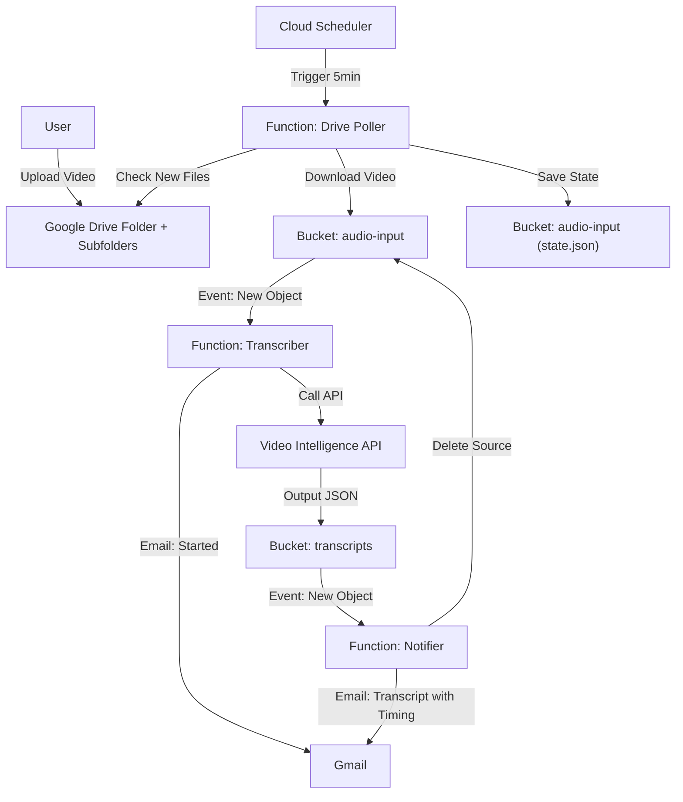

# Google Drive to Video Transcription Pipeline

Automates the process of transcribing video files uploaded to a Google Drive folder using Google Cloud Platform (GCP).

## Features

- **Automatic detection** of new video files in Google Drive (including subfolders)
- **Video transcription** using Google Cloud Video Intelligence API
- **Human-readable email notifications** with timestamps and transcript preview
- **Idempotency** - no duplicate emails on retries
- **Auto-cleanup** - source videos are deleted after transcription
- **Duration limit** - videos over 5 hours are automatically skipped
- **Secure access** - transcripts are accessible only to authorized users

## Architecture

The system is built on GCP using **Cloud Functions (2nd Gen)**, **Cloud Storage**, **Cloud Scheduler**, and the **Video Intelligence API**.



## Setup & Deployment

### Prerequisites
1.  **GCP Project** with Billing Enabled.
2.  **Google Drive Folder** (created and ID copied).
3.  **Gmail App Password** (for sending notifications).

### 1. Configure
Create `infra/terraform.tfvars`:
```hcl
project_id         = "your-project-id"
region             = "us-central1"
drive_folder_id    = "your-drive-folder-id"
notification_email = "recipient@example.com"
gmail_user         = "sender@gmail.com"
gmail_app_password = "your-16-char-app-password"
```

### 2. Deploy
Run the deployment script (wrapper around Terraform):
```bash
./deploy.sh
```

### 3. Grant Access (One-time)
At the end of deployment, you will see an output:
`service_account_email = "drive-bot@..."`
**You MUST share your Google Drive Folder with this email (Editor role).**

---

## How it Works (Component Breakdown)

### 1. Drive Poller (`src/drive-poller`)
*   **Trigger**: Runs every 5 minutes (Cloud Scheduler).
*   **Logic**:
    1.  Reads `drive-poller-state.json` from the Input Bucket to know the last check time.
    2.  Recursively scans the target folder **and all subfolders** for new video files.
    3.  Filters for video files only (`.mp4`, `.mov`, `.avi`, `.mkv`, `.webm`, `.m4v`, `.wmv`, `.flv`).
    4.  **Skips videos longer than 5 hours** (based on Drive metadata).
    5.  Downloads new files and streams them to the Input Bucket.
    6.  Updates `drive-poller-state.json`.

### 2. Transcriber (`src/transcriber`)
*   **Trigger**: Eventarc (New file in Input Bucket).
*   **Logic**:
    1.  **Skips non-video files** (e.g., state.json).
    2.  **Idempotency check** - skips if file was already processed (via GCS metadata).
    3.  Calls **Google Cloud Video Intelligence API** (`annotateVideo`).
    4.  Marks file as processed in GCS metadata.
    5.  Sends "Transcription Started" email (only after job successfully starts).
    6.  **Note**: This is an async long-running operation. The function starts the job and exits.

### 3. Notifier (`src/notifier`)
*   **Trigger**: Eventarc (New JSON file in Transcripts Bucket).
*   **Logic**:
    1.  **Idempotency check** - skips if notification was already sent.
    2.  Reads and parses the Video Intelligence JSON output.
    3.  **Formats transcript** with timestamps in human-readable format.
    4.  Sends "Transcript Ready" email with formatted transcript.
    5.  Marks transcript as notified in GCS metadata.
    6.  **Deletes the source video** from the input bucket (cleanup).

---

## Email Format

### Transcription Started
```
Subject: [Drive Automation] Transcription Started

Processing file: video.mp4
We'll notify you when it's done.
```

### Transcript Ready
```
Subject: [Drive Automation] Transcript: video.mp4

Your video "video.mp4" has been transcribed!

═══════════════════════════════════════════════════════
TRANSCRIPT
═══════════════════════════════════════════════════════

[0:00 - 0:15]
This is the first segment of speech from the video...

[0:15 - 0:32]
And this is the next segment with automatic timing...

[0:32 - 1:05]
The transcript continues with each paragraph timestamped...

═══════════════════════════════════════════════════════

View raw JSON: https://storage.cloud.google.com/bucket/video.mp4.json
```

---

## Debugging Guide

If something isn't working, follow this trail:

### Level 1: "It didn't pick up my file"
**Check the Poller.**
1.  Go to **Cloud Logging**.
2.  Query: `resource.type="cloud_run_revision" AND resource.labels.service_name="drive-poller"`
3.  **Look for**:
    *   `Monitoring X folders (including subfolders)` -> Confirms subfolder scanning is working.
    *   `Found X new files.` -> If 0, check your Drive Folder ID and if the Service Account has access.
    *   `Skipping file "X" - duration Xh exceeds 5h limit` -> Video was too long.
4.  **Force a Rescan**:
    *   Delete the state file: `gcloud storage rm gs://YOUR_INPUT_BUCKET/drive-poller-state.json`
    *   Manually trigger the job: `gcloud scheduler jobs run trigger-drive-poller --location=us-central1`

### Level 2: "It picked up the file, but no email/transcript"
**Check the Transcriber.**
1.  Query: `resource.type="cloud_run_revision" AND resource.labels.service_name="transcriber"`
2.  **Look for**:
    *   `Skipping non-video file: ...` -> File was filtered out (expected for state.json).
    *   `Skipping already-processed file: ...` -> Idempotency kicked in (expected on retries).
    *   `Starting Video Intelligence job for ...` -> Job started successfully.
    *   **Errors**: Quota exceeded? Invalid API key? (Make sure Video Intelligence API is enabled).

### Level 3: "I got the start email, but never the finish email"
**Check the Video Intelligence Operation.**
*   Video processing takes time (roughly 50-100% of video duration).
*   If the video is long, wait longer.
*   Check the **Transcripts Bucket**: `gs://YOUR_TRANSCRIPTS_BUCKET/`
    *   If the JSON file appears there, the API worked.
    *   If the JSON is there but no email -> Check **Level 4**.

### Level 4: "The JSON is there, but no final email"
**Check the Notifier.**
1.  Query: `resource.type="cloud_run_revision" AND resource.labels.service_name="notifier"`
2.  **Look for**:
    *   `Skipping already-notified file: ...` -> Idempotency kicked in.
    *   `NOTIFICATION for ...` -> Email was sent.
    *   `Cleaned up source file: ...` -> Source video was deleted.
    *   **Errors**: `Invalid login` (Wrong App Password?), `ECONNREFUSED` (Network issues?).

### Level 5: "I can't access the transcript link"
**Check bucket permissions.**
*   The transcript link requires authentication with the `gmail_user` account.
*   Open the link while logged into that Google account.
*   Or download via CLI: `gcloud storage cat gs://BUCKET/file.json`

---

## Limitations

| Limit | Value | Reason |
|-------|-------|--------|
| Max video duration | 5 hours | Video Intelligence API processing time/cost |
| Polling frequency | 5 minutes | Cloud Scheduler minimum practical interval |
| Supported formats | `.mp4`, `.mov`, `.avi`, `.mkv`, `.webm`, `.m4v`, `.wmv`, `.flv` | Common video formats |

---

## Cost Reference
*   **Video Intelligence API**: First 1000 minutes/month are **Free**. Then ~$0.048/min.
*   **Cloud Functions**: First 2 million invocations/month are **Free**.
*   **Cloud Storage**: Standard rates (pennies for text/video).

## Updates & Maintenance
To update code (e.g., change email text):
1.  Edit the code in `src/...`
2.  Run `./deploy.sh`
3.  Terraform detects the change and redeploys only the updated function.

## Cleanup
To remove all resources:
```bash
cd infra && terraform destroy
```
