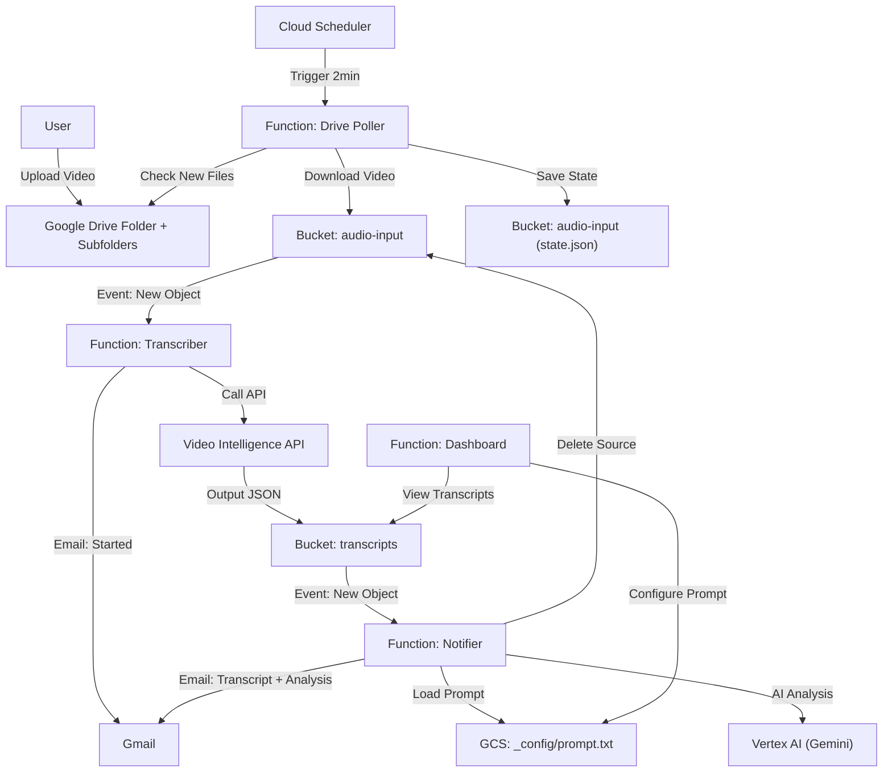

# Google Drive to Video Transcription Pipeline

Automates the process of transcribing video files uploaded to a Google Drive folder using Google Cloud Platform (GCP), with optional AI-powered analysis.

## Features

- **Automatic detection** of new video files in Google Drive (including subfolders)
- **Video transcription** using Google Cloud Video Intelligence API
- **AI Analysis** using Vertex AI (Gemini 2.5 Flash) with customizable prompts
- **Web Dashboard** for viewing transcripts and configuring AI prompts
- **Human-readable email notifications** with timestamps, transcript, and AI analysis
- **Idempotency** - no duplicate emails on retries
- **Auto-cleanup** - source videos are deleted after transcription
- **Duration limit** - videos over 5 hours are automatically skipped
- **Secure access** - transcripts are accessible only to authorized users

## Architecture

The system is built on GCP using **Cloud Functions (2nd Gen)**, **Cloud Storage**, **Cloud Scheduler**, **Video Intelligence API**, and **Vertex AI**.



## Setup & Deployment

### Prerequisites
1.  **GCP Project** with Billing Enabled.
2.  **Google Drive Folder** (created and ID copied).
3.  **Gmail App Password** (for sending notifications).

### 1. Configure
Create `infra/terraform.tfvars`:
```hcl
project_id         = "your-project-id"
region             = "us-central1"
drive_folder_id    = "your-drive-folder-id"

# Email Notifications
notification_email = "recipient@example.com"      # Who gets the email?
gmail_user         = "sender@gmail.com"           # Who sends it?
gmail_app_password = "your-16-char-app-password"  # Gmail App Password
send_start_email   = true                         # Send "Transcription Started" email?

# Dashboard
dashboard_password = "your-dashboard-password"    # Password for dashboard access
```

### 2. Deploy
Run the deployment script (wrapper around Terraform):
```bash
./deploy.sh
```

Or deploy directly with Terraform:
```bash
cd infra && terraform init && terraform apply
```

### 3. Grant Access (One-time)
At the end of deployment, you will see outputs:
```
dashboard_url = "https://dashboard-xxx-uc.a.run.app"
service_account_email = "drive-bot@your-project.iam.gserviceaccount.com"
```
**You MUST share your Google Drive Folder with the service account email (Editor role).**

---

## Dashboard

The dashboard provides a web interface to:
- **View all transcripts** with links to transcript and analysis files
- **Configure the AI prompt** used for analysis
- **Monitor processing** status

### Accessing the Dashboard

**URL with password (recommended for bookmarking):**
```
https://dashboard-xxx-uc.a.run.app?p=your-password
```

**Or use Basic Authentication:**
- Username: anything
- Password: your configured `dashboard_password`

### Configuring AI Analysis Prompt

1. Open the dashboard
2. Enter your analysis prompt in the "AI Analysis Prompt" textarea
3. Click "Save Prompt"
4. All future transcriptions will use this prompt

**Example prompts:**
- "Summarize this video transcript. List the main topics and any action items."
- "Extract key insights and quotes from this meeting transcript."
- "Identify the speakers and summarize what each person discussed."

---

## How it Works (Component Breakdown)

### 1. Drive Poller (`src/drive-poller`)
*   **Trigger**: Runs every 2 minutes (Cloud Scheduler).
*   **Logic**:
    1.  Reads `drive-poller-state.json` from the Input Bucket to know the last check time.
    2.  Recursively scans the target folder **and all subfolders** for new video files.
    3.  Filters for video files only (`.mp4`, `.mov`, `.avi`, `.mkv`, `.webm`, `.m4v`, `.wmv`, `.flv`).
    4.  **Skips videos longer than 5 hours** (based on Drive metadata).
    5.  Downloads new files and streams them to the Input Bucket.
    6.  Updates `drive-poller-state.json`.

### 2. Transcriber (`src/transcriber`)
*   **Trigger**: Eventarc (New file in Input Bucket).
*   **Logic**:
    1.  **Skips non-video files** (e.g., state.json).
    2.  **Idempotency check** - skips if file was already processed (via GCS metadata).
    3.  Calls **Google Cloud Video Intelligence API** (`annotateVideo`).
    4.  Marks file as processed in GCS metadata.
    5.  Sends "Transcription Started" email (configurable via `send_start_email`).
    6.  **Note**: This is an async long-running operation. The function starts the job and exits.

### 3. Notifier (`src/notifier`)
*   **Trigger**: Eventarc (New JSON file in Transcripts Bucket).
*   **Logic**:
    1.  **Idempotency check** - skips if notification was already sent.
    2.  Reads and parses the Video Intelligence JSON output.
    3.  **Formats transcript** with timestamps in human-readable format.
    4.  **AI Analysis** (if prompt configured):
        - First checks GCS for prompt (`_config/prompt.txt` - set via dashboard)
        - Falls back to Google Drive (`_prompts/PROMPT.md` in watched folder)
        - Sends transcript to Vertex AI (Gemini 2.5 Flash) with prompt
    5.  Saves transcript and analysis to GCS.
    6.  Sends email with formatted transcript and AI analysis as attachments.
    7.  Marks transcript as notified in GCS metadata.
    8.  **Deletes the source video** from the input bucket (cleanup).

### 4. Dashboard (`src/dashboard`)
*   **Trigger**: HTTP requests.
*   **Logic**:
    1.  Authenticates via URL parameter (`?p=password`) or Basic Auth.
    2.  Lists all transcript files from the Transcripts Bucket.
    3.  Displays prompt configuration editor.
    4.  Handles prompt save requests (stores to `_config/prompt.txt` in GCS).

---

## Email Format

### Transcription Started (Optional)
```
Subject: [Drive Automation] Transcription Started

Processing file: video.mp4
We'll notify you when it's done.
```

### Transcript Ready (with AI Analysis)
```
Subject: [Drive Automation] Analysis & Transcript: video.mp4

Your video "video.mp4" has been processed!

Video Duration: 5 min 32 sec

The transcript and AI analysis are attached to this email.

═══════════════════════════════════════════════════════
AI ANALYSIS
═══════════════════════════════════════════════════════

[Your AI analysis based on the configured prompt...]

═══════════════════════════════════════════════════════
LINKS
═══════════════════════════════════════════════════════

Raw JSON: https://storage.cloud.google.com/bucket/video.mp4.json

To view the full transcript or analysis, open the attached files.
```

**Attachments:**
- `video.mp4_TRANSCRIPT.txt` - Full transcript with timestamps
- `video.mp4_ANALYSIS.txt` - AI analysis (if prompt configured)

---

## Debugging Guide

If something isn't working, follow this trail:

### Level 1: "It didn't pick up my file"
**Check the Poller.**
```bash
gcloud functions logs read drive-poller --project=YOUR_PROJECT --region=us-central1 --limit=50
```
**Look for**:
- `Monitoring X folders (including subfolders)` -> Confirms subfolder scanning is working.
- `Found X new files.` -> If 0, check your Drive Folder ID and if the Service Account has access.
- `Skipping file "X" - duration Xh exceeds 5h limit` -> Video was too long.

**Force a Rescan**:
```bash
gcloud storage rm gs://YOUR_INPUT_BUCKET/drive-poller-state.json
gcloud scheduler jobs run trigger-drive-poller --location=us-central1
```

### Level 2: "It picked up the file, but no email/transcript"
**Check the Transcriber.**
```bash
gcloud functions logs read transcriber --project=YOUR_PROJECT --region=us-central1 --limit=50
```
**Look for**:
- `Skipping non-video file: ...` -> File was filtered out (expected for state.json).
- `Skipping already-processed file: ...` -> Idempotency kicked in (expected on retries).
- `Starting Video Intelligence job for ...` -> Job started successfully.
- **Errors**: Quota exceeded? Invalid API key?

### Level 3: "I got the start email, but never the finish email"
**Check the Video Intelligence Operation.**
- Video processing takes time (roughly 50-100% of video duration).
- Check the **Transcripts Bucket**: `gs://YOUR_TRANSCRIPTS_BUCKET/`
- If the JSON file appears there, the API worked.

### Level 4: "The JSON is there, but no final email"
**Check the Notifier.**
```bash
gcloud functions logs read notifier --project=YOUR_PROJECT --region=us-central1 --limit=50
```
**Look for**:
- `Found prompt in GCS config` -> Dashboard prompt is being used.
- `Found prompt template. Running AI analysis...` -> AI analysis started.
- `AI Analysis complete.` -> AI analysis succeeded.
- `NOTIFICATION for ...` -> Email was sent.
- `Cleaned up source file: ...` -> Source video was deleted.
- **Errors**: `Invalid login` (Wrong App Password?), AI errors (check Vertex AI quota).

### Level 5: "AI Analysis failed"
**Common issues:**
- `GCP_PROJECT environment variable not set` -> Check Terraform deployment.
- `response.text is not a function` -> SDK version mismatch (should be fixed).
- `Quota exceeded` -> Check Vertex AI quotas in GCP Console.

---

## Limitations

| Limit | Value | Reason |
|-------|-------|--------|
| Max video duration | 5 hours | Video Intelligence API processing time/cost |
| Polling frequency | 2 minutes | Cloud Scheduler interval |
| Supported formats | `.mp4`, `.mov`, `.avi`, `.mkv`, `.webm`, `.m4v`, `.wmv`, `.flv` | Common video formats |
| AI Model | Gemini 2.5 Flash | Vertex AI model for analysis |

---

## Cost Reference
*   **Video Intelligence API**: First 1000 minutes/month are **Free**. Then ~$0.048/min.
*   **Vertex AI (Gemini)**: Pay-per-token pricing (very low for text analysis).
*   **Cloud Functions**: First 2 million invocations/month are **Free**.
*   **Cloud Storage**: Standard rates (pennies for text/video).

## Updates & Maintenance
To update code (e.g., change email text):
1.  Edit the code in `src/...`
2.  Run `terraform apply` in the `infra/` directory
3.  Terraform detects the change and redeploys only the updated function.

## Cleanup
To remove all resources:
```bash
cd infra && terraform destroy
```
