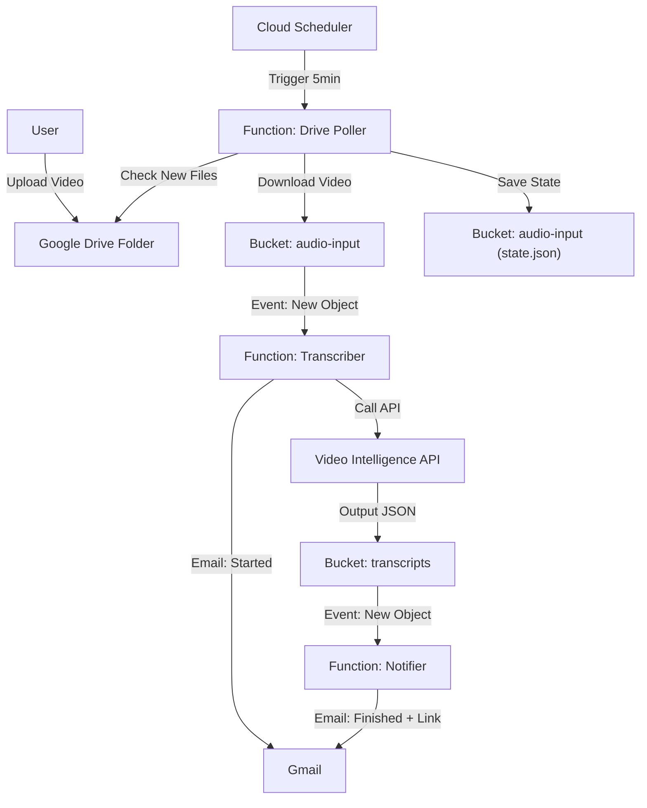

# Google Drive to Video Transcription Pipeline

Automates the process of transcribing video files uploaded to a Google Drive folder using Google Cloud Platform (GCP).

## 🏗 Architecture

The system is built on GCP using **Cloud Functions (2nd Gen)**, **Cloud Storage**, **Cloud Scheduler**, and the **Video Intelligence API**.



## 🚀 Setup & Deployment

### Prerequisites
1.  **GCP Project** with Billing Enabled.
2.  **Google Drive Folder** (created and ID copied).
3.  **Gmail App Password** (for sending notifications).

### 1. Configure
Create `infra/terraform.tfvars`:
```hcl
project_id         = "your-project-id"
region             = "us-central1"
drive_folder_id    = "your-drive-folder-id"
notification_email = "recipient@example.com"
gmail_user         = "sender@gmail.com"
gmail_app_password = "your-16-char-app-password"
```

### 2. Deploy
Run the deployment script (wrapper around Terraform):
```bash
./deploy.sh
```

### 3. Grant Access (One-time)
At the end of deployment, you will see an output:
`service_account_email = "drive-bot@..."`
**You MUST share your Google Drive Folder with this email (Editor role).**

---

## 🔍 How it Works (Component Breakdown)

### 1. Drive Poller (`src/drive-poller`)
*   **Trigger**: Runs every 5 minutes (Cloud Scheduler).
*   **Logic**:
    1.  Reads `drive-poller-state.json` from the Input Bucket to know the last check time.
    2.  Queries Google Drive API for files created *after* that time AND where `mimeType contains 'video/'`.
    3.  Downloads new files and streams them to the Input Bucket.
    4.  Updates `drive-poller-state.json`.

### 2. Transcriber (`src/transcriber`)
*   **Trigger**: Eventarc (New file in Input Bucket).
*   **Logic**:
    1.  Sends "Transcription Started" email.
    2.  Calls **Google Cloud Video Intelligence API** (`annotateVideo`).
    3.  Sets output URI to the Transcripts Bucket.
    4.  **Note**: This is an async long-running operation. The function starts the job and exits. GCP handles the processing in the background.

### 3. Notifier (`src/notifier`)
*   **Trigger**: Eventarc (New JSON file in Transcripts Bucket).
*   **Logic**:
    1.  Reads the JSON file generated by the API.
    2.  Parses the complex Video Intelligence JSON structure to extract the text.
    3.  Sends "Transcript Ready" email with a preview and a direct link to the file on GCS.

---

## 🛠 Debugging Guide

If something isn't working, follow this trail:

### Level 1: "It didn't pick up my file"
**Check the Poller.**
1.  Go to **Cloud Logging**.
2.  Query: `resource.type="cloud_run_revision" AND resource.labels.service_name="drive-poller"`
3.  **Look for**:
    *   `Found X new files.` -> If 0, check your Drive Folder ID and if the Service Account has access.
    *   `Polling for files created after: ...` -> Verify the timestamp looks correct.
4.  **Force a Rescan**:
    *   Delete the state file: `gcloud storage rm gs://YOUR_INPUT_BUCKET/drive-poller-state.json`
    *   Manually trigger the job: `gcloud scheduler jobs run trigger-drive-poller --location=us-central1`

### Level 2: "It picked up the file, but no email/transcript"
**Check the Transcriber.**
1.  Query: `resource.type="cloud_run_revision" AND resource.labels.service_name="transcriber"`
2.  **Look for**:
    *   `Starting Video Intelligence job for ...`
    *   **Errors**: Quota exceeded? invalid API key? (Make sure Video Intelligence API is enabled).

### Level 3: "I got the start email, but never the finish email"
**Check the Video Intelligence Operation.**
*   Video processing takes time (roughly 50-100% of video duration).
*   If the video is long, wait longer.
*   Check the **Transcripts Bucket**: `gs://YOUR_TRANSCRIPTS_BUCKET/`
    *   If the JSON file appears there, the API worked.
    *   If the JSON is there but no email -> Check **Level 4**.

### Level 4: "The JSON is there, but no final email"
**Check the Notifier.**
1.  Query: `resource.type="cloud_run_revision" AND resource.labels.service_name="notifier"`
2.  **Look for**:
    *   `NOTIFICATION for ...`
    *   **Errors**: `Invalid login` (Wrong App Password?), `ECONNREFUSED` (Network/Firewall issues?).

## 💰 Cost Reference
*   **Video Intelligence API**: First 1000 minutes/month are **Free**. Then ~$0.048/min.
*   **Cloud Functions**: First 2 million invocations/month are **Free**.
*   **Cloud Storage**: Standard rates (pennies for text/audio).

## 🔄 Updates & Maintenance
To update code (e.g., change email text):
1.  Edit the code in `src/...`
2.  Run `./deploy.sh`
3.  Terraform detects the change and redeploys only the updated function.
